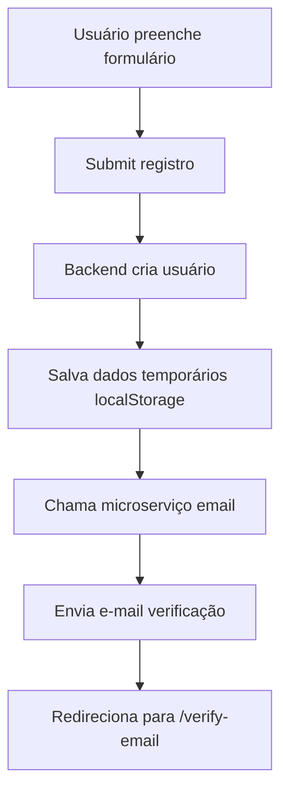
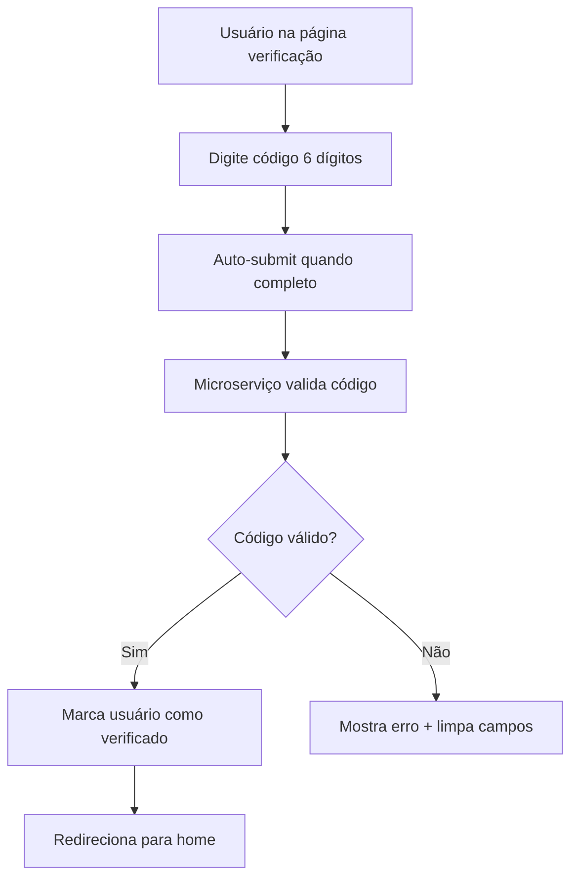
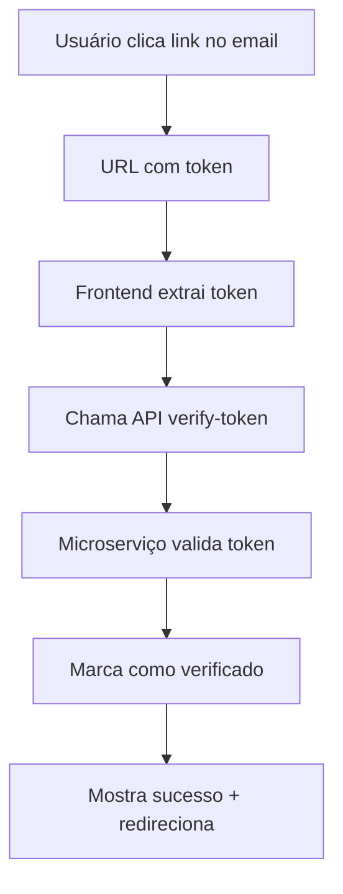

# 📧 Sistema de Verificação de E-mail - Vibe

Sistema completo de verificação de e-mail implementado para a rede social Vibe, com microserviço especializado, templates HTML responsivos e limitações de segurança.

## 🌟 Funcionalidades Implementadas

### ✅ **Microserviço de E-mail (Express.js)**
- **Porta**: `3001`
- **SMTP**: Configurado com Hostinger
- **Escalabilidade**: Serviço independente e facilmente escalável
- **Monitoramento**: Endpoint `/health` para verificação de status

### ✅ **Verificação Pós-Cadastro**
- Redirecionamento automático para página de confirmação
- Envio imediato do e-mail de verificação
- Interface moderna e responsiva

### ✅ **Página de Confirmação**
- **Edição de e-mail**: Usuário pode corrigir e-mail se digitou errado
- **Código de 6 dígitos**: Interface intuitiva com auto-foco
- **Verificação automática**: Código é verificado assim que completado
- **Feedback visual**: Mensagens claras de sucesso/erro

### ✅ **Limitação de Reenvio**
- **Cooldown**: 1 minuto entre reenvios
- **Contagem regressiva**: Visual em tempo real
- **Anti-spam**: Máximo 5 tentativas por hora
- **Bloqueio temporário**: 1 hora de bloqueio após exceder limite

### ✅ **E-mail com Template HTML**
- **Remetente**: `no-reply@meuvibe.com`
- **Nome da rede**: "Vibe"
- **Design responsivo**: Funciona em desktop e mobile
- **Dupla verificação**: Código para copiar + botão de confirmação
- **Segurança**: Avisos sobre não solicitar cadastro

### ✅ **Banco de Dados Configurado**
- **Tabela `email_verifications`**: Armazena códigos e tokens
- **Índices otimizados**: Performance garantida
- **Chaves estrangeiras**: Integridade referencial
- **Limpeza automática**: Códigos expirados são removidos

### ✅ **Expiração e Limites**
- **Tempo de expiração**: 5 minutos (300 segundos)
- **Códigos únicos**: Geração segura com crypto
- **Tokens de verificação**: Para links de confirmação
- **Auditoria**: Log de tentativas e status

## 🏗️ Arquitetura do Sistema

```
┌─────���───────────┐    ┌─────────────────┐    ┌─────────────────┐
│                 │    │                 │    │                 │
│   Frontend      │    │   Backend       │    │  Email Service  │
│   (React)       │    │   (FastAPI)     │    │   (Express)     │
│   Port: 5173    │    │   Port: 8000    │    │   Port: 3001    │
│                 │    │                 │    │                 │
└─────────┬───────┘    └─────────┬───────┘    └─────────┬───────┘
          │                      │                      │
          │                      │                      │
          └──────────────────────┼──────────────────────┘
                                 │
                         ┌───────▼────────┐
                         │                │
                         │    MySQL       │
                         │   Database     │
                         │                │
                         └────────────────┘
```

## 📋 Configuração e Instalação

### 1. **Configuração do Banco de Dados**
```bash
cd backend
python3 setup_email_verification.py
```

### 2. **Instalação do Microserviço**
```bash
cd backend/email-service
npm install
```

### 3. **Configuração SMTP**
Arquivo: `backend/email-service/.env`
```env
SMTP_HOST=smtp.hostinger.com
SMTP_PORT=587
SMTP_USER=suporte@meuvibe.com
SMTP_PASS=Dashwoodi@1995
SMTP_FROM=no-reply@meuvibe.com
```

### 4. **Inicialização Completa**
```bash
# Opção 1: Script automático
python3 backend/start_system.py

# Opção 2: Manual
# Terminal 1 - Microserviço Email
cd backend/email-service && npm start

# Terminal 2 - Backend Principal  
cd backend && python3 main.py

# Terminal 3 - Frontend
npm run dev
```

## 🔧 API Endpoints

### **Microserviço de E-mail (Port 3001)**

#### `POST /send-verification`
Enviar e-mail de verificação
```json
{
  "email": "usuario@exemplo.com",
  "firstName": "João",
  "userId": 123
}
```

#### `POST /verify-code`
Verificar código de 6 dígitos
```json
{
  "userId": 123,
  "code": "123456"
}
```

#### `POST /verify-token`
Verificar token do link do e-mail
```json
{
  "token": "abc123..."
}
```

#### `GET /verification-status/:userId`
Verificar status de verificação

#### `GET /health`
Status do serviço

## 🗄️ Estrutura do Banco de Dados

### **Tabela: `email_verifications`**
```sql
CREATE TABLE email_verifications (
    id INT AUTO_INCREMENT PRIMARY KEY,
    user_id INT NOT NULL,
    email VARCHAR(255) NOT NULL,
    verification_code VARCHAR(6) NOT NULL,
    verification_token VARCHAR(64) NOT NULL,
    expires_at DATETIME NOT NULL,
    verified BOOLEAN DEFAULT FALSE,
    verified_at DATETIME NULL,
    attempts INT DEFAULT 1,
    created_at DATETIME DEFAULT CURRENT_TIMESTAMP,
    -- Índices e constraints...
);
```

### **Tabela: `email_logs`** (Auditoria)
```sql
CREATE TABLE email_logs (
    id INT AUTO_INCREMENT PRIMARY KEY,
    user_id INT NOT NULL,
    email VARCHAR(255) NOT NULL,
    email_type ENUM('verification', 'password_reset', 'notification'),
    status ENUM('sent', 'failed', 'bounced'),
    error_message TEXT NULL,
    sent_at DATETIME DEFAULT CURRENT_TIMESTAMP
);
```

## 🎯 Fluxo de Verificação

### **1. Registro do Usuário**


### **2. Verificação por Código**


### **3. Verificação por Link**


## 🔐 Segurança Implementada

### **Limitações Anti-Spam**
- ✅ Máximo 5 tentativas por hora por usuário
- ✅ Cooldown de 1 minuto entre reenvios
- ✅ Códigos expiram em 5 minutos
- ✅ Tokens únicos e seguros

### **Validações**
- ✅ Validação de formato de e-mail
- ✅ Verificação de usuário existente
- ✅ Códigos numéricos de 6 dígitos
- ✅ Tokens hexadecimais de 64 caracteres

### **Auditoria**
- ✅ Log de todas as tentativas de envio
- ✅ Registro de status (enviado/falhou)
- ✅ Timestamp de verificação
- ✅ Contagem de tentativas

## 🎨 Interface do Usuário

### **Página de Verificação** (`/verify-email`)
- **Design responsivo**: Mobile-first
- **Campos de código**: 6 inputs com auto-foco
- **Edição de e-mail**: Botão para corrigir e-mail
- **Contagem regressiva**: Timer visual para reenvio
- **Feedback imediato**: Mensagens de sucesso/erro
- **Verificação automática**: Submit ao completar código

### **Estados da Interface**
- 🔄 **Loading**: Spinner durante verificação
- ✅ **Sucesso**: Ícone verde + redirecionamento
- ❌ **Erro**: Mensagem vermelha + reset
- ⏱️ **Cooldown**: Timer com botão desabilitado
- 📝 **Edição**: Formulário para novo e-mail

## 📧 Template de E-mail

### **Características**
- **HTML responsivo**: Funciona em todos os clientes
- **Identidade visual**: Logo e cores do Vibe
- **Código destacado**: Box com código de 6 dígitos
- **Botão CTA**: Link de verificação direta
- **Informações de segurança**: Avisos sobre phishing
- **Footer informativo**: Dados da empresa

### **Conteúdo**
- Saudação personalizada com nome
- Código de verificação visual
- Botão "Confirmar E-mail"
- Aviso sobre expiração (5 minutos)
- Instruções de segurança
- Footer com copyright

## 🚀 Como Testar

### **1. Teste Completo**
```bash
# 1. Iniciar sistema
python3 backend/start_system.py

# 2. Acessar frontend
http://localhost:5173

# 3. Fazer cadastro
# 4. Verificar e-mail recebido
# 5. Testar código OU link
```

### **2. Teste da API**
```bash
# Teste de saúde
curl http://localhost:3001/health

# Teste de envio
curl -X POST http://localhost:3001/send-verification \
  -H "Content-Type: application/json" \
  -d '{"email":"teste@exemplo.com","firstName":"Teste","userId":1}'
```

### **3. Verificar Banco**
```sql
-- Ver verificações pendentes
SELECT * FROM email_verifications WHERE verified = FALSE;

-- Ver logs de e-mail
SELECT * FROM email_logs ORDER BY sent_at DESC LIMIT 10;

-- Ver usuários verificados
SELECT id, email, is_verified FROM users WHERE is_verified = TRUE;
```

## 🔧 Troubleshooting

### **Problemas Comuns**

#### **E-mail não chega**
- ✅ Verificar configurações SMTP
- ✅ Checar spam/lixo eletrônico
- ✅ Verificar logs do microserviço
- ✅ Testar endpoint `/test-email`

#### **Código inválido**
- ✅ Verificar se código não expirou (5 min)
- ✅ Confirmar se foi digitado corretamente
- ✅ Verificar banco de dados
- ✅ Tentar reenviar novo código

#### **Muitas tentativas**
- ✅ Aguardar 1 hora para reset automático
- ✅ Ou limpar tabela `email_verifications` manualmente

#### **Microserviço não inicia**
- ✅ Verificar se porta 3001 está livre
- ✅ Confirmar dependências instaladas (`npm install`)
- ✅ Verificar arquivo `.env` existe
- ✅ Testar conectividade SMTP

## 📁 Arquivos Importantes

```
backend/
├── email-service/              # Microserviço de e-mail
│   ├── index.js               # Servidor Express
│   ├── package.json           # Dependências Node
│   └── .env                   # Configurações SMTP
├── setup_email_verification.py # Setup banco Python
├── setup_email_verification.sql # Schema SQL
└── start_system.py            # Inicialização completa

src/
├── pages/
│   └── EmailVerificationPage.tsx # Página verificação
├── services/
│   └── EmailVerificationService.ts # API calls
└── App.tsx                     # Rotas adicionadas
```

## 🎯 Próximos Passos (Opcional)

### **Melhorias Futuras**
- [ ] **E-mail de boas-vindas** após verificação
- [ ] **Template customizável** via admin
- [ ] **Estatísticas** de taxa de verificação
- [ ] **Integração com SendGrid/Mailgun** para escala
- [ ] **Verificação por SMS** como alternativa
- [ ] **Dashboard admin** para monitoramento

### **Otimizações**
- [ ] **Cache Redis** para códigos
- [ ] **Queue system** para e-mails
- [ ] **Rate limiting** mais sofisticado
- [ ] **Métricas** com Prometheus
- [ ] **Logs estruturados** com Winston

---

## ✅ **Sistema Pronto para Produção!**

O sistema de verificação de e-mail está completamente implementado e funcional, com todas as especificações solicitadas:

1. ✅ **Microserviço especializado** em Express
2. ✅ **Página de confirmação** com edição de e-mail
3. ✅ **Limitação de reenvio** com contagem regressiva
4. ✅ **E-mail HTML** com código e botão
5. ✅ **Scripts organizados** e banco configurado
6. ✅ **Códigos com expiração** e limites de segurança

**Para iniciar**: `python3 backend/start_system.py`

🚀 **Vibe está pronto para verificar e-mails!**
