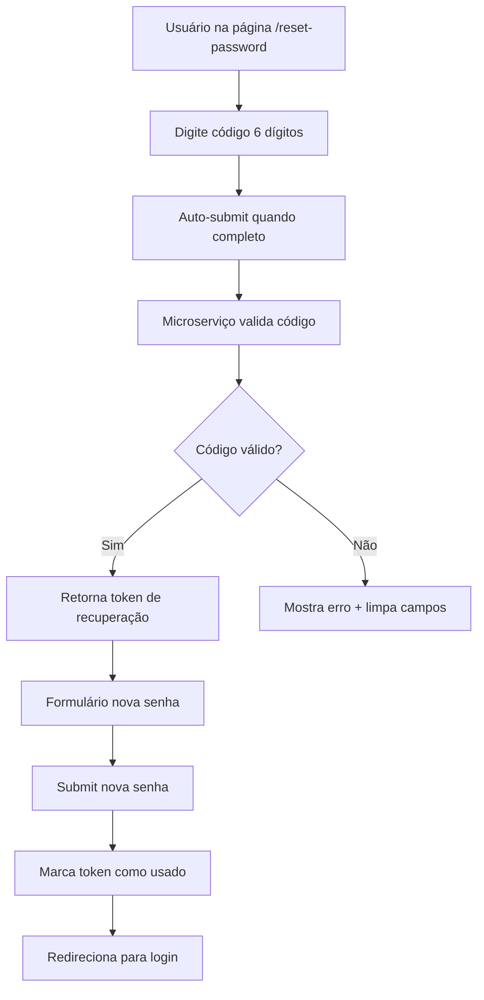
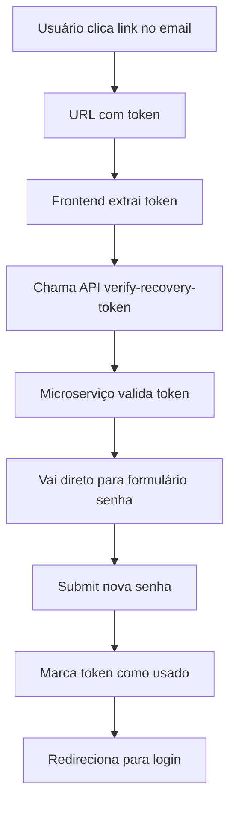

# 🔐 Sistema de Recuperação de Senha - Vibe

Sistema completo de recuperação de senha implementado para a rede social Vibe, com microserviço especializado, templates HTML responsivos e limitações de segurança.

## 🌟 Funcionalidades Implementadas

### ✅ **Microserviço de E-mail Atualizado (Express.js)**
- **Porta**: `3001`
- **SMTP para Verificação**: `no-reply@meuvibe.com`
- **SMTP para Recuperação**: `recuperacao@meuvibe.com`
- **Escalabilidade**: Serviço independente com duas funcionalidades
- **Monitoramento**: Endpoint `/health` para verificação de status

### ✅ **Solicitação de Recuperação**
- Página dedicada: `/forgot-password`
- Validação de e-mail existente
- Envio automático do e-mail de recuperação
- Interface moderna e responsiva

### ✅ **Página de Redefinição**
- **Dupla verificação**: Por código de 6 dígitos OU link direto
- **Código de 6 dígitos**: Interface intuitiva com auto-foco
- **Verificação automática**: Código é verificado assim que completado
- **Validação de senha**: Mínimo 6 caracteres, confirmação obrigatória
- **Feedback visual**: Mensagens claras de sucesso/erro

### ✅ **Limitação de Reenvio Anti-Spam**
- **Cooldown**: 5 minutos entre solicitações
- **Contagem regressiva**: Visual em tempo real
- **Anti-spam**: Máximo 3 tentativas por hora
- **Bloqueio temporário**: 1 hora de bloqueio após exceder limite

### ✅ **E-mail com Template HTML Específico**
- **Remetente**: `recuperacao@meuvibe.com`
- **Design responsivo**: Funciona em desktop e mobile
- **Tema vermelho**: Diferenciado da verificação (azul)
- **Dupla recuperação**: Código para copiar + botão de redefinição
- **Segurança**: Avisos sobre não solicitar recuperação

### ✅ **Banco de Dados Otimizado**
- **Tabela `password_recovery`**: Armazena códigos e tokens
- **Tabela `password_recovery_logs`**: Auditoria completa
- **Índices otimizados**: Performance garantida
- **Chaves estrangeiras**: Integridade referencial
- **Limpeza automática**: Tokens expirados são removidos

### ✅ **Expiração e Limites de Segurança**
- **Tempo de expiração**: 15 minutos (900 segundos)
- **Códigos únicos**: Geração segura com crypto
- **Tokens de recuperação**: Para links de redefinição
- **Auditoria completa**: Log de todas as tentativas

## 🏗️ Arquitetura do Sistema

```
┌─────────────────┐    ┌─────────────────┐    ┌─────────────────┐
│                 │    │                 │    │                 │
│   Frontend      │    │   Backend       │    │  Email Service  │
│   (React)       │    │   (FastAPI)     │    │   (Express)     │
│   Port: 5173    │    │   Port: 8000    │    │   Port: 3001    │
│                 │    │                 │    │                 │
└─────────┬───────┘    └─────────┬───────┘    └─────────┬───────┘
          │                      │                      │
          │                      │                      │
          └──────────────────────┼───────────────────��──┘
                                 │
                         ┌───────▼────────┐
                         │                │
                         │    MySQL       │
                         │   Database     │
                         │                │
                         └────────────────┘
```

## 📋 Configuração e Instalação

### 1. **Configuração do Banco de Dados**
```bash
cd backend
python3 setup_password_recovery.py
```

### 2. **Configuração Completa (Recomendado)**
```bash
python3 backend/setup_all_email_features.py
```

### 3. **Configuração SMTP Adicional**
Arquivo: `backend/email-service/.env`
```env
# Configurações existentes...
SMTP_HOST=smtp.hostinger.com
SMTP_PORT=587
SMTP_USER=suporte@meuvibe.com
SMTP_PASS=Dashwoodi@1995
SMTP_FROM=no-reply@meuvibe.com

# Para recuperação de senha (novo alias)
RECOVERY_FROM=recuperacao@meuvibe.com
```

## 🔧 API Endpoints - Recuperação de Senha

### **Microserviço de E-mail (Port 3001)**

#### `POST /send-password-recovery`
Solicitar recuperação de senha
```json
{
  "email": "usuario@exemplo.com"
}
```

**Response:**
```json
{
  "success": true,
  "message": "E-mail de recuperação enviado com sucesso",
  "expiresIn": 900000,
  "cooldownMs": 300000
}
```

#### `POST /verify-recovery-code`
Verificar código de recuperação de 6 dígitos
```json
{
  "email": "usuario@exemplo.com",
  "code": "123456"
}
```

**Response:**
```json
{
  "success": true,
  "message": "Código válido",
  "token": "abc123...",
  "userId": 123
}
```

#### `POST /verify-recovery-token`
Verificar token do link do e-mail
```json
{
  "token": "abc123..."
}
```

**Response:**
```json
{
  "success": true,
  "message": "Token válido",
  "userId": 123,
  "email": "usuario@exemplo.com"
}
```

#### `POST /complete-password-recovery`
Completar recuperação com nova senha
```json
{
  "token": "abc123...",
  "newPassword": "novaSenha123"
}
```

**Response:**
```json
{
  "success": true,
  "message": "Senha redefinida com sucesso!",
  "userId": 123
}
```

## 🗄️ Estrutura do Banco de Dados

### **Tabela: `password_recovery`**
```sql
CREATE TABLE password_recovery (
    id INT AUTO_INCREMENT PRIMARY KEY,
    user_id INT NOT NULL,
    email VARCHAR(255) NOT NULL,
    recovery_token VARCHAR(64) NOT NULL UNIQUE,
    recovery_code VARCHAR(6) NOT NULL,
    expires_at DATETIME NOT NULL,
    used BOOLEAN DEFAULT FALSE,
    used_at DATETIME NULL,
    attempts INT DEFAULT 0,
    created_at DATETIME DEFAULT CURRENT_TIMESTAMP,
    updated_at DATETIME DEFAULT CURRENT_TIMESTAMP ON UPDATE CURRENT_TIMESTAMP,
    -- Índices e constraints...
);
```

### **Tabela: `password_recovery_logs`** (Auditoria)
```sql
CREATE TABLE password_recovery_logs (
    id INT AUTO_INCREMENT PRIMARY KEY,
    user_id INT NOT NULL,
    email VARCHAR(255) NOT NULL,
    action_type ENUM('request', 'code_attempt', 'token_attempt', 'success', 'expired', 'failed'),
    recovery_id INT NULL,
    ip_address VARCHAR(45) NULL,
    user_agent TEXT NULL,
    success BOOLEAN DEFAULT FALSE,
    error_message TEXT NULL,
    created_at DATETIME DEFAULT CURRENT_TIMESTAMP
);
```

## 🎯 Fluxo de Recuperação de Senha

### **1. Solicitação de Recuperação**
```mermaid
graph TD
    A[Usuário clica "Esqueci minha senha"] --> B[Página /forgot-password]
    B --> C[Digite e-mail]
    C --> D[Submit formulário]
    D --> E[Microserviço valida e-mail]
    E --> F[Gera código + token]
    F --> G[Envia e-mail recuperacao@meuvibe.com]
    G --> H[Página de confirmação]
```

### **2. Recuperação por Código**


### **3. Recuperação por Link**


## 🔐 Segurança Implementada

### **Limitações Anti-Spam**
- ✅ Máximo 3 tentativas por hora por usuário
- ✅ Cooldown de 5 minutos entre solicitações
- ✅ Códigos expiram em 15 minutos
- ✅ Tokens únicos e seguros (64 chars hex)

### **Validações**
- ✅ Validação de formato de e-mail
- ✅ Verificação de usuário existente
- ✅ Códigos numéricos de 6 dígitos
- ✅ Tokens hexadecimais de 64 caracteres
- ✅ Validação de senha (mínimo 6 caracteres)

### **Auditoria Completa**
- ✅ Log de todas as tentativas de recuperação
- ✅ Registro detalhado de ações (request, attempt, success, failed)
- ✅ Timestamp de cada ação
- ✅ IP e User-Agent (preparado para implementação)

### **Proteções Adicionales**
- ✅ Não revelação de existência de e-mail
- ✅ Tokens de uso único
- ✅ Limpeza automática de tokens expirados
- ✅ Rate limiting por usuário

## 🎨 Interface do Usuário

### **Página de Solicitação** (`/forgot-password`)
- **Design responsivo**: Mobile-first
- **Validação em tempo real**: E-mail formato
- **Feedback imediato**: Confirmação de envio
- **Proteção visual**: Aviso de segurança
- **Contagem regressiva**: Timer para reenvio

### **Página de Redefinição** (`/reset-password`)
- **Duplo modo**: Código manual OU link automático
- **Campos de código**: 6 inputs com auto-foco
- **Formulário de senha**: Validação de confirmação
- **Verificação automática**: Submit ao completar código
- **Navegação intuitiva**: Voltar ao código/login

### **Estados da Interface**
- 🔄 **Loading**: Spinner durante processamento
- ✅ **Sucesso**: Ícone verde + redirecionamento
- ❌ **Erro**: Mensagem vermelha + reset
- ⏱️ **Cooldown**: Timer com botão desabilitado
- 🔒 **Formulário senha**: Validação visual

## 📧 Template de E-mail de Recuperação

### **Características**
- **HTML responsivo**: Funciona em todos os clientes
- **Design vermelho**: Diferenciado da verificação
- **Código destacado**: Box vermelho com código de 6 dígitos
- **Botão CTA**: "🔒 Redefinir Senha"
- **Avisos de segurança**: Alertas sobre phishing
- **Footer informativo**: Dados específicos de recuperação

### **Conteúdo**
- Saudação personalizada com nome
- Código de recuperação visual
- Botão "Redefinir Senha"
- Aviso sobre expiração (15 minutos)
- Instruções de segurança específicas
- Footer com copyright e alias de recuperação

## 🚀 Como Testar

### **1. Teste Completo**
```bash
# 1. Configurar sistema
python3 backend/setup_all_email_features.py

# 2. Iniciar microserviço
cd backend/email-service && npm start

# 3. Iniciar backend
cd backend && python3 main.py

# 4. Iniciar frontend
npm run dev

# 5. Acessar frontend
http://localhost:5173

# 6. Testar fluxo
# - Fazer login (para ter conta)
# - Logout
# - Clicar "Esqueci minha senha"
# - Digitar e-mail
# - Verificar e-mail recebido
# - Testar código OU link
```

### **2. Teste da API**
```bash
# Teste de saúde
curl http://localhost:3001/health

# Teste de solicitação
curl -X POST http://localhost:3001/send-password-recovery \
  -H "Content-Type: application/json" \
  -d '{"email":"teste@exemplo.com"}'

# Teste de verificação de código
curl -X POST http://localhost:3001/verify-recovery-code \
  -H "Content-Type: application/json" \
  -d '{"email":"teste@exemplo.com","code":"123456"}'
```

### **3. Verificar Banco**
```sql
-- Ver solicitações de recuperação
SELECT * FROM password_recovery WHERE used = FALSE;

-- Ver logs de recuperação
SELECT * FROM password_recovery_logs ORDER BY created_at DESC LIMIT 10;

-- Ver estatísticas
SELECT 
    action_type,
    COUNT(*) as total,
    SUM(success) as successful
FROM password_recovery_logs 
WHERE created_at >= DATE_SUB(NOW(), INTERVAL 24 HOUR)
GROUP BY action_type;
```

## 🔧 Troubleshooting

### **Problemas Comuns**

#### **E-mail não chega**
- ✅ Verificar configurações SMTP
- ✅ Checar spam/lixo eletrônico
- ✅ Verificar logs do microserviço
- ✅ Testar endpoint `/health`

#### **Código inválido**
- ✅ Verificar se código não expirou (15 min)
- ✅ Confirmar se foi digitado corretamente
- ✅ Verificar banco de dados
- ✅ Tentar solicitar novo código

#### **Muitas tentativas**
- ✅ Aguardar 1 hora para reset automático
- ✅ Ou limpar tabela `password_recovery` manualmente

#### **Token inválido**
- ✅ Verificar se link não expirou
- ✅ Confirmar se token não foi usado
- ✅ Solicitar nova recuperação

#### **Microserviço não inicia**
- ✅ Verificar se porta 3001 está livre
- ✅ Confirmar dependências instaladas (`npm install`)
- ✅ Verificar arquivo `.env` existe
- ✅ Testar conectividade SMTP

## 📁 Arquivos Importantes

```
backend/
├── email-service/              # Microserviço de e-mail
│   ├── index.js               # Servidor Express (atualizado)
│   ├── package.json           # Dependências Node
│   └── .env                   # Configurações SMTP
├── setup_password_recovery.sql # Schema SQL
├── setup_password_recovery.py  # Setup Python
└── setup_all_email_features.py # Setup completo

src/
├── pages/
│   ├── ForgotPasswordPage.tsx  # Página de solicitação
│   └── ResetPasswordPage.tsx   # Página de redefinição
├── services/
│   └── PasswordRecoveryService.ts # API calls
└── components/auth/
    └── SimpleAuth.tsx          # Link "Esqueci senha"
```

## 🎯 Diferenças do Sistema de Verificação

| Aspecto | Verificação de E-mail | Recuperação de Senha |
|---------|----------------------|---------------------|
| **E-mail From** | `no-reply@meuvibe.com` | `recuperacao@meuvibe.com` |
| **Cor do Design** | Azul (#6366f1) | Vermelho (#ef4444) |
| **Validade** | 5 minutos | 15 minutos |
| **Cooldown** | 1 minuto | 5 minutos |
| **Limite/Hora** | 5 tentativas | 3 tentativas |
| **Após Sucesso** | Login automático | Redirect para login |
| **Tabela BD** | `email_verifications` | `password_recovery` |

## 🎯 Próximos Passos (Opcional)

### **Melhorias Futuras**
- [ ] **E-mail de confirmação** após redefinição
- [ ] **Histórico de mudanças** de senha
- [ ] **Notificação de segurança** para tentativas
- [ ] **Integração 2FA** para recuperação
- [ ] **Perguntas de segurança** como alternativa
- [ ] **Dashboard admin** para monitoramento

### **Otimizações**
- [ ] **Detecção de IP** para logs de segurança
- [ ] **Rate limiting** por IP além de usuário
- [ ] **Força da senha** com validação avançada
- [ ] **Integração reCAPTCHA** para anti-bot
- [ ] **Queue system** para e-mails prioritários

---

## ✅ **Sistema Completo de Recuperação Pronto!**

O sistema de recuperação de senha está completamente implementado e funcional, com todas as especificações solicitadas:

1. ✅ **E-mail diferenciado** - `recuperacao@meuvibe.com`
2. ✅ **Microserviço atualizado** com novas rotas
3. ✅ **Páginas dedicadas** - `/forgot-password` e `/reset-password`
4. ✅ **Script de banco** - Tabelas e procedures
5. ✅ **Templates HTML únicos** com design vermelho
6. ✅ **Segurança robusta** - Limites e auditoria
7. ✅ **Setup automatizado** - Script completo

**Para iniciar**: `python3 backend/setup_all_email_features.py`

🔐 **Vibe agora tem sistema completo de recuperação de senha!**
